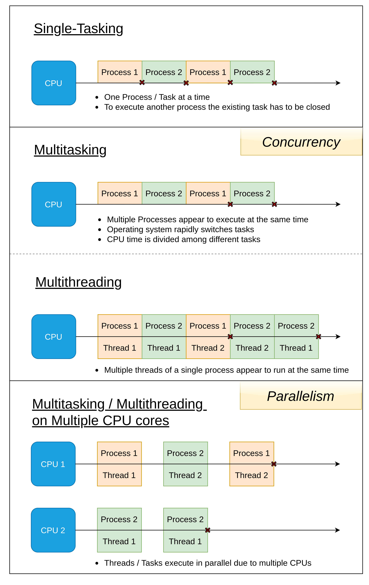

#  Java Concurrency & Multithreading

## Concurrency

**Concurrency** is the ability of the system to handle multiple tasks or processes at the same time. 

> **Note**: It doesn't necessarily mean that these tasks are executed truly simultaneously, but rather they appear to be running concurrently.

## Features, Benefits, and Challenges of Concurrency

### Key Points
* **Interleaving:** The system switches between different tasks very rapidly, giving the illusion of simultaneous execution.
* **Parallelism:** While related, parallelism refers to the actual simultaneous execution of multiple tasks on multiple processors or cores.
* **Shared Resources:** Concurrent tasks often share resources, which can lead to issues like race conditions and deadlocks if not managed carefully.

### Benefits of Concurrency
* **Improved responsiveness:** Applications can continue to respond to user input while performing background tasks.
* **Increased throughput:** Multiple tasks can be processed simultaneously, improving overall performance.
* **Better resource utilization:** Systems can make efficient use of available hardware resources.

### Challenges of Concurrency
* **Complexity:** Concurrent programming can be challenging due to the potential for unexpected interactions between tasks.
* **Synchronization:** Coordinating access to shared resources is essential to prevent race conditions and data corruption.
* **Debugging:** Identifying and fixing concurrency-related issues can be challenging.

## Single-Tasking vs. Multitasking vs. Multithreading

* **Single-Tasking**: One Program/Process/Task at a time 
* **Multitasking**: Multiple programs (process) **appear to run simultaneously**.
  * CPU executes the Operating System. Then the **OS switches the Process** rapidly, giving the illusion of simultaneous execution.
  * Achieved by dividing CPU time among different processes
  * Each process has its own memory space and resources.
* **Multithreading**: Multiple parts (threads) of the same process appear to run simultaneously within the process.
  * Multithreading is a subset of multitasking. 
  * Threads share the same memory space and resources.

## Concurrency vs. Multithreading

### Concurrency
* Concurrency focuses on the overall structure and design of an application to handle multiple tasks. 
* This can be achieved through various means such as multithreading, asynchronous programming, or cooperative multitasking. 
* Multithreading is a specific way to implement concurrency, but it's not the only way. 
* All multithreaded systems are concurrent.
* **Example**: A web server handling multiple requests concurrently.

### Multithreading
* Multithreading focuses on the management and coordination of multiple threads within a process.
* It involves creating and managing threads, sharing resources, and handling synchronization
* Concurrency is a broader concept about how tasks are structured and managed.
* Not all concurrent systems are multithreaded.
* **Example**: A word processor using multiple threads for spell checking, formatting, and display updates.

## References

* Youtube
  * [Java Concurrency and Multithreading @ Jakob Jenkov](https://www.youtube.com/playlist?list=PLL8woMHwr36EDxjUoCzboZjedsnhLP1j4)
  * https://www.youtube.com/watch?v=WldMTtUWqTg
* https://www.linkedin.com/pulse/evolution-concurrency-java-eric-kolotyluk/