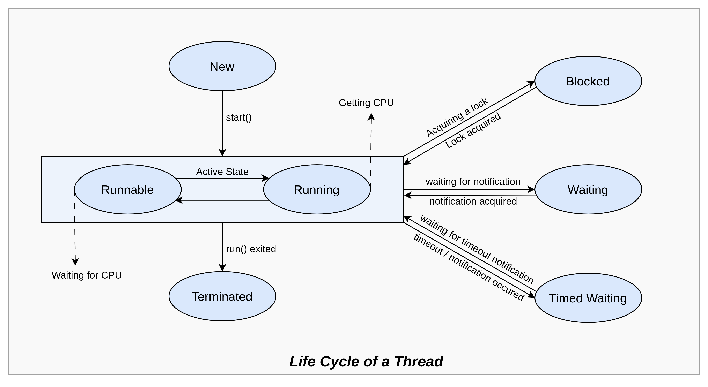

# Threads

## Lifecycle and States of a Thread

##  Creating Threads in Java

### Thread Class

### Runnable Interface

## Thread Methods

## Thread Scheduler

## Thread Priority

## References
* Medium
  * [Java Threads](https://medium.com/@nadinCodeHat/java-threads-1e4890ab0de0)
    * **Note**: resume(), stop(), suspend() methods are deprecated in Threads class
* Geeks for Geeks
  * [Multithreading in Java](https://www.geeksforgeeks.org/multithreading-in-java)
  * [Lifecycle and states of a Thread](https://www.geeksforgeeks.org/lifecycle-and-states-of-a-thread-in-java)
* Javatpoint
  * [Multithreading in Java](https://www.javatpoint.com/multithreading-in-java)
* Scaler Topics
  * [Thread in Java](https://www.scaler.com/topics/thread-in-java/)