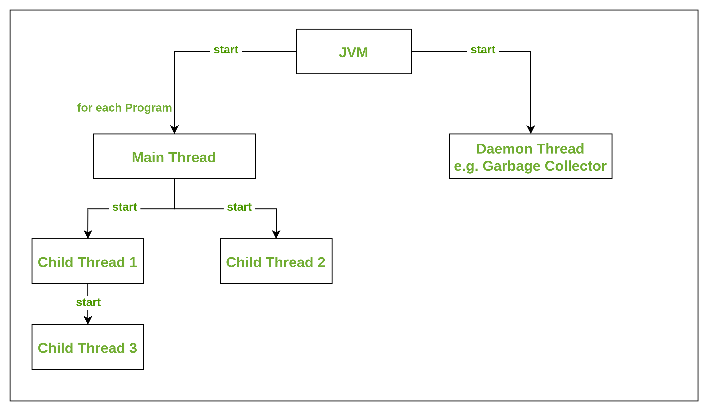
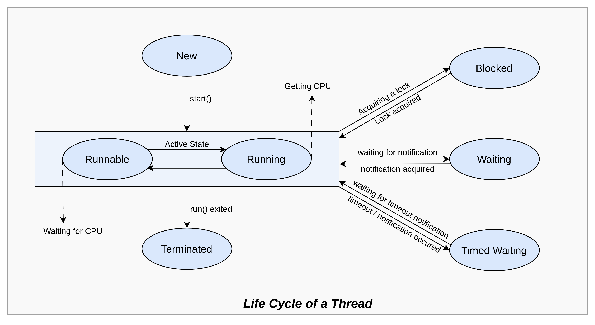
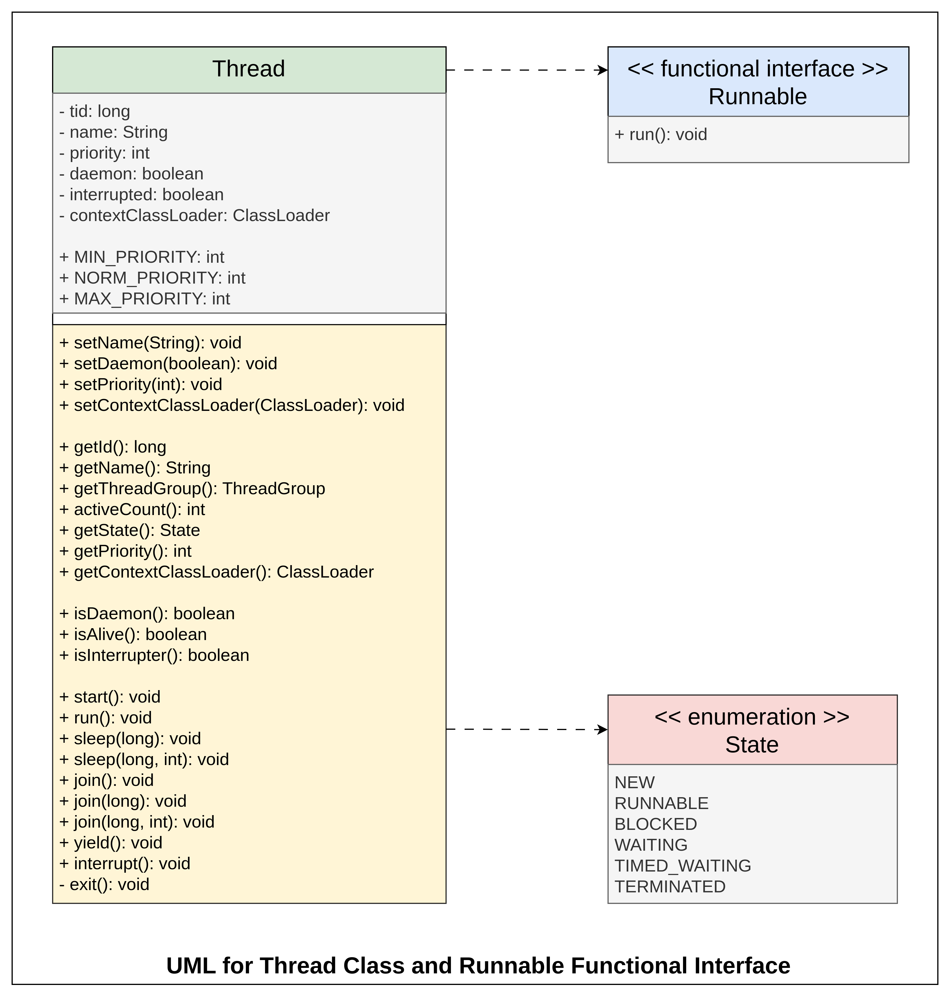

#  Threads 

<!-- > 
**Note**:
Managed by Operating System hence called as Platform / OS Level Threads

OS Threads can be heavy at times. since each thread requires 1-2mb of stack space.
To tackle the above issue, Java has Project LOOM where the threads are managed by JVM itself.
These Threads might be referred to as Green Threads/Fibres.
<! -->

<div align="right">

[&larr; Prev](ConcurrencyAndMultithreading.md) | 
</div>

A thread is a lightweight subprocess within a process. It represents a separate path of execution within a program. In simpler terms, it's like multiple tasks running concurrently within a single application.


##  Creating Threads in Java

[Code Link](codes/CreateThreads.java)

### Thread Class

```jshelllanguage
// MyThread class extends Thread class and implements the run method from Runnable implemented by Thread class
class MyThread extends Thread {
    public void run() {
        System.out.println(Thread.currentThread().getName() + " is running");
    }
}

// Main Class
public class ExtendThreadClassDemo {
    public static void main(String[] args) {
        for (int i = 0; i < 20; i++) {
            // The Operating System will decide which thread to run when
            MyThread thread = new MyThread();
            thread.start();
        }
    }
}
```

### Runnable Interface

```jshelllanguage
class MyRunnable implements Runnable {
    @Override
    public void run() {
        System.out.println(Thread.currentThread().getName() + " is running");
    }
}

// Main Class
public class ImplementRunnableInterfaceDemo {
    public static void main(String[] args) {
        for (int i = 0; i < 20; i++) {
            // The Operating System will decide which thread to run when
            Thread thread = new Thread(new MyRunnable());
            thread.start();
        }
    }
}
```

### Thread Class vs. Runnable Interface
* If we extend the Thread class, our class cannot extend any other class because Java doesn’t support multiple inheritance. But, if we implement the Runnable interface, our class can still extend other base classes. 
* We can achieve the basic functionality of a thread by extending Thread class because it provides some inbuilt methods like yield(), interrupt() etc. that are not available in Runnable interface. 
* Using runnable will give you an object that can be shared amongst multiple threads.

## Stop a Thread

[Code Link](codes/ThreadStop.java)


## Types of Threads


1. **User Threads**
   * JVM stays alive until all the user threads are terminated.
   * **e.g.**: Main Thread of a program
2. **Daemon Threads**
   * JVM stops even if a daemon thread is running.
   * Typically, have lower priority
   * Dependent on user threads since they can be terminated abruptly when all user threads finish.
   * They are usually used for background tasks that do not require application to wait for completion, monitor system resources or application behaviour, etc.
   * **e.g.**: Garbage Collector, Finalization, other system-level operations.

[Code Link](codes/ThreadBasics.java)

> **Note**:
> * The allocation of time of execution to a thread is governed by a **thread scheduler**.
> * A thread in Java is executed as per the priority. The thread with higher priority is executed first then the threads with lower priorities are executed.
> * JVM keeps will stay alive as long as there are any remaining **user threads** that are running.
> * If all user threads have finished, the JVM will terminate, even if **daemon threads** are still running.
> * User threads created in the main method will run independent of the Main thread state.
> * We can also make the main thread to wait for completion of a thread using **thread.join()** in the main method.


## Lifecycle and States of a Thread



1. **NEW**: Thread is created but not started. In this state the code inside the thread is yet to be run.
2. **RUNNABLE (Active State)**: A thread moves from the new state to the active state when the thread invokes the start() method. The thread in the active state can be in a runnable state or a running state.
   * **Runnable State**: Thread is ready to run but waiting for CPU time. 
     * In the runnable state, there is a queue where the threads lie.
   * **Running State**: Thread is currently being executed. 
     * A thread is moved from the runnable state to the running state by the thread scheduler. By the running state, we mean that the thread gets the CPU for its execution. A fixed duration of execution time is always allocated to a thread in Java.
3. **BLOCKED**: Thread is waiting for a resource or event. 
   * The thread will be in blocked state when it is trying to acquire a lock, but currently the lock is acquired by the other thread. The thread will move from the blocked state to runnable state when it acquires the lock.
4. **WAITING**: Thread is waiting for a notification.
   * The thread will be in waiting state when it calls wait() method or join() method. It will move to the runnable state when the other thread notifies it or that thread will be terminated. 
   * Whenever the main thread calls the join() method (to attach itself with other thread(s)), then the main method or main thread goes into the waiting state. After invoking the join() method, the main thread waits for its child thread to be executed first.
   * The following methods can be used to make thread go into waiting state
     * **Object.wait** with no timeout 
     * **Thread.join** with no timeout 
     * **LockSupport.park** (add code example)
5. **TIMED_WAITING**: Thread is waiting for a specific period.
   * A thread lies in a timed waiting state when it calls a method with a time-out parameter. A thread lies in this state until the timeout is completed or until a notification is received. 
   * For example, when a thread calls sleep or a conditional wait, it is moved to a timed waiting state.
   * The following methods with positive waiting time can be used to make thread go into timed-waiting state 
     * **Thread.sleep** 
     * **Object.wait** with timeout 
     * **Thread.join** with timeout 
     * **LockSupport.parkNanos** 
     * **LockSupport.parkUntil**
6. **TERMINATED**: Thread has finished execution.
   * Thread goes into terminated state after completion of the run or an abnormal termination due to unhandled errors or exceptions. 
   * When we start the JVM or the Java Virtual Machine, a single thread (typically called the main method) is started. This main thread continues and executes other threads until the following conditions are met:
      * The exit() private method has been called up. 
      * All the other threads have exited after executing their instructions.


## Thread Methods



### Getters in Thread
* **getId()**:
* **getName()**:
* **getThreadGroup()**:
* **activeCount()**:
* **getState()**:
* **getPriority()**:
* **getContextClassLoader()**:

### Setters in Thread
* **setName(String)**:
* **setDaemon(boolean)**:
* **setPriority(int)**:
* **setContextClassLoader(ClassLoader)**:

### Boolean Methods in Thread Class
* **isDaemon()**:
* **isAlive()**:
* **isInterrupter()**:

### Thread State Methods
* **start()**: Starts the thread.
* **run()**: Contains the thread's code.
* **sleep(long) / sleep(long, int)**: Pauses the thread for a specified time.
* **join() / join(long) / join(long, int)**: Wait for a thread to complete before proceeding.
* **yield() [static method]**: Suggests that the current thread gives up the CPU to other threads.
* **interrupt()**: Interrupts a thread
* **exit() [private method]**: The main thread is completed and JVM stops

### Deprecated Thread State Methods
* **resume(), stop(), suspend(), checkAccess()** methods are deprecated in Threads class

### Object class Methods for Synchronization:
* **wait()/ wait(long) / wait(long, int)**: wait method is defined in Object class. Keeps the thread in waiting state by using locks (requires synchronization).
* **notify()**: Use notify method to change Thread from waiting to running state.
* **notifyAll()**: Use notifyAll method if multiple threads are waiting.


## Thread Scheduler
* Manages thread execution. 
* Decides which thread to run based on priority and other factors. 
* JVM component responsible for scheduling.

## Thread Priority
* Numerical value indicating thread importance. 
* Ranges from 1 (MIN_PRIORITY) to 10 (MAX_PRIORITY), and defaults to 5 (NORM_PRIORITY). 
* Higher priority threads have a better chance to run. Not a strict guarantee, other factors influence scheduling. 
* Set using setPriority() method.


## References
* Medium
  * [Java Threads](https://medium.com/@nadinCodeHat/java-threads-1e4890ab0de0)
    * **Note**: resume(), stop(), suspend() methods are deprecated in Threads class
  * [Create Threads](https://medium.com/@kulkarnishruti/deep-dive-into-different-types-of-threads-in-java-and-how-to-create-them-2e113a3deca4)
* Geeks for Geeks
  * [Multithreading in Java](https://www.geeksforgeeks.org/multithreading-in-java)
  * [Lifecycle and states of a Thread](https://www.geeksforgeeks.org/lifecycle-and-states-of-a-thread-in-java)
* Javatpoint
  * [Multithreading in Java](https://www.javatpoint.com/multithreading-in-java)
  * [Types of Threads](https://www.javatpoint.com/types-of-threads-in-java)
* Scaler Topics
  * [Thread in Java](https://www.scaler.com/topics/thread-in-java/)
* Youtube
  * [Java Threads @ Jakob Jenkov](https://www.youtube.com/watch?v=eQk5AWcTS8w&list=PLL8woMHwr36EDxjUoCzboZjedsnhLP1j4&index=2)
* cs.lmu.edu Notes
  * [Java Threading](https://cs.lmu.edu/~ray/notes/javathreading/)


<div align="right">

[&larr; Prev](ConcurrencyAndMultithreading.md) | 
</div>
