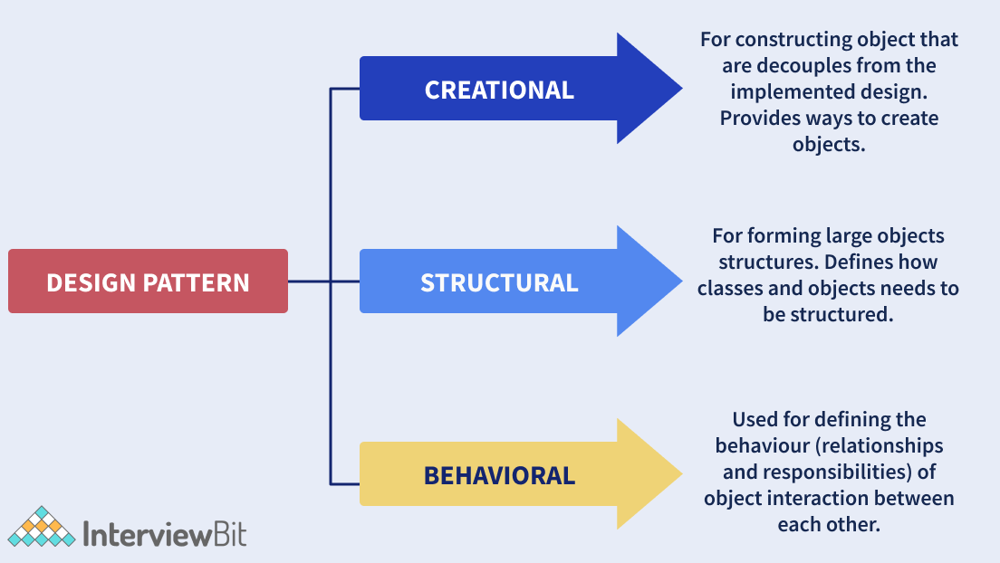
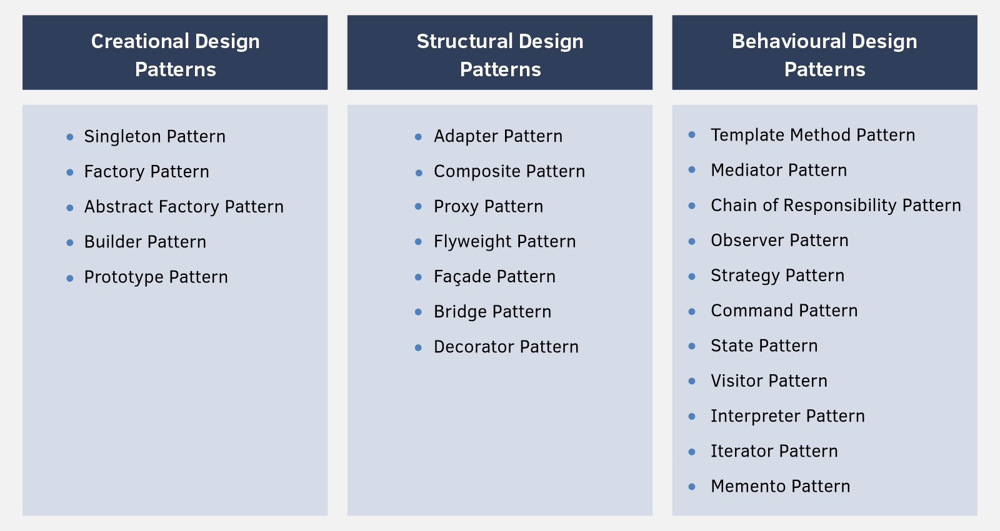

## Design Patterns

- Design patterns are the reusable template solutions that are for solving common problems that occur in software development such as repetitive code, reusable patterns, redundant functions etc.
- They are similar to customizable blueprints for solving any problem.
- They are not the complete implementation of any problem. They just design the idea of the solution.

## Types of Design Patterns

There are three types of design patterns in Java. These are as follows:
1. Creational Design Pattern
2. Structural Design Pattern 
3. Behavioral Design Pattern

## List of Design Patterns

## 

### 1. Creational Design Patterns

Creational design patterns provide various ways to instantiate objects, helping to control the creation process in a way that is more efficient, flexible, or adaptable.

**Key Characteristics**:
1. **Encapsulation of Object Creation**: Creational patterns encapsulate the process of object creation, making it easier to change or extend the instantiation logic without affecting other parts of the code.
2. **Reduction of Complexity**: These patterns simplify the creation process of complex objects by providing a structured and consistent way of handling object creation.
3. **Promotion of Loose Coupling**: By using these patterns, the code is less dependent on specific classes and more reliant on interfaces or abstract classes, leading to a more modular and maintainable system.

#### 1.1. Singleton Pattern
The Singleton Pattern ensures that a class has only one instance and provides a global point of access to that instance. This is useful when exactly one object is needed to coordinate actions across the system.

#### 1.2. Factory Pattern
The Factory Pattern defines an interface for creating an object but allows subclasses to alter the type of objects that will be created. It promotes loose coupling by eliminating the need to bind application-specific classes into the code.

#### 1.3. Abstract Factory Pattern
The Abstract Factory Pattern provides an interface for creating families of related or dependent objects without specifying their concrete classes. It is often used when there are multiple types of objects that need to be created together.

#### 1.4. Builder Pattern
The Builder Pattern separates the construction of a complex object from its representation so that the same construction process can create different representations. It is particularly useful when the object creation process involves many steps or configurations.

It provides an interface for constructing an object and then have concrete builder classes that implement this interface to create specific objects in a stepwise manner.

#### 1.5. Prototype Pattern
The Prototype Pattern creates new objects by copying an existing object, known as the prototype. This pattern is useful when the cost of creating a new instance of a class is expensive, and you want to clone existing objects instead.

#### 1.6. Object Pool Pattern
The Object Pool Pattern manages a pool of reusable objects. Instead of creating new instances every time an object is needed, the pool provides an already instantiated object, which can be returned to the pool when no longer in use. This pattern improves performance and memory usage in resource-intensive applications

## 

### 2. Structural Design Pattern

Structural design patterns in Java focus on how classes and objects are composed to form larger structures while keeping these structures flexible and efficient. These patterns simplify the relationships between entities, making the design more manageable and scalable.

#### 2.1 Adapter Pattern
The Adapter Pattern allows incompatible interfaces to work together. It acts as a bridge between two incompatible interfaces by converting the interface of a class into another interface the client expects. When an object is used to combine two different interfaces, then we call it as object adapter. If the class is used, then we call it as class adapter.

- **Example**: Connecting a legacy system with a new system by wrapping the legacy code with an adapter class.

#### 2.2 Bridge Pattern
The Bridge Pattern decouples an abstraction from its implementation so that the two can vary independently. It involves an interface that acts as a bridge, making the functionality of the concrete classes independent of interface implementers. To hide the implementation part of an interface from the client application use bridge pattern. It allows access to the abstraction part and not to the implementation part.

- **Example**: Separating the interface and implementation of different shapes and colors so that they can be combined freely.

#### 2.3. Composite Pattern
The Composite Pattern allows you to compose objects into tree-like structures to represent part-whole hierarchies. It lets clients treat individual objects and compositions of objects uniformly.

- **Example**: Representing a hierarchical structure such as an organization chart, where both employees and departments can be treated uniformly.

#### 2.4. Decorator Pattern
The Decorator Pattern allows behavior to be added to an individual object, dynamically, without affecting the behavior of other objects from the same class. It’s used to add functionality to objects without altering their structure.

- **Example**: Adding additional features like scrollbars, borders, etc., to a window in a graphical user interface (GUI).

#### 2.5. Facade Pattern
The Facade Pattern provides a simplified interface to a complex subsystem. It offers a higher-level interface that makes the subsystem easier to use.

- **Example**: A single interface to interact with complex underlying systems like a multimedia system.

#### 2.6. Flyweight Pattern
The Flyweight Pattern minimizes memory usage by sharing as much data as possible with other similar objects. It is particularly useful when you need to create a large number of similar objects.

- **Example**: Sharing common data (like character glyphs in a text editor) among multiple objects to reduce memory footprint.

#### 2.7. Proxy Pattern
The Proxy Pattern provides a surrogate or placeholder for another object to control access to it. It is used to create a representative object that controls access to another object, which may be remote, expensive to create, or need protection.

- **Example**: A proxy class that represents a complex or resource-intensive object and controls access to it, like a security proxy that controls access to the real object based on permissions.

## 

## References

- https://www.naukri.com/code360/guided-paths/advanced-java/content/498413/offering/7421429
- https://www.geeksforgeeks.org/java-design-patterns/
- https://www.javatpoint.com/design-patterns-in-java
- https://www.interviewbit.com/design-patterns-interview-questions/
- AlgoMaster References for common Design Patterns (Code Examples)
  - 𝐒𝐢𝐧𝐠𝐥𝐞𝐭𝐨𝐧: https://lnkd.in/gRNRc8dr
  - 𝐅𝐚𝐜𝐭𝐨𝐫𝐲 𝐌𝐞𝐭𝐡𝐨𝐝: https://lnkd.in/gPaqQwNc
  - 𝐁𝐮𝐢𝐥𝐝𝐞𝐫: https://lnkd.in/gDGTgcYB
  - 𝐀𝐝𝐚𝐩𝐭𝐞𝐫: https://lnkd.in/grz6Ht9Z
  - 𝐅𝐚𝐜𝐚𝐝𝐞: https://lnkd.in/gpU_j7Je
  - 𝐃𝐞𝐜𝐨𝐫𝐚𝐭𝐨𝐫: https://lnkd.in/gpVYXXCq
  - 𝐂𝐨𝐦𝐩𝐨𝐬𝐢𝐭𝐞: https://lnkd.in/gNXjbeCH
  - 𝐒𝐭𝐫𝐚𝐭𝐞𝐠𝐲: https://lnkd.in/gZuFZwmi
  - 𝐈𝐭𝐞𝐫𝐚𝐭𝐨𝐫: https://lnkd.in/gbbYC4hZ
  - 𝐎𝐛𝐬𝐞𝐫𝐯𝐞𝐫: https://lnkd.in/gV9JKaCQ