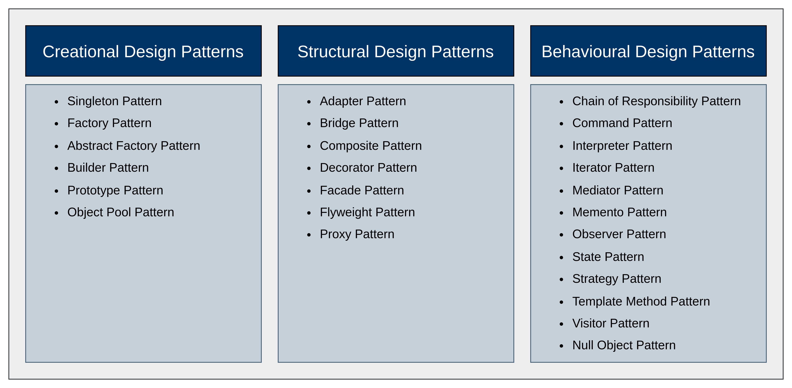

## Design Patterns

- Design patterns are the reusable template solutions that are for solving common problems that occur in software development such as repetitive code, reusable patterns, redundant functions, etc.
- They are similar to customizable blueprints for solving any problem.
- They are not the complete implementation of any problem. They just design the idea of the solution.

## Types of Design Patterns

There are three types of design patterns in Java. These are as follows:
1. Creational Design Pattern
2. Structural Design Pattern 
3. Behavioral Design Pattern

## List of Design Patterns

## 

### 1. Creational Design Patterns

Creational design patterns in Java deal with object creation mechanisms, trying to create objects in a manner suitable for the situation. These patterns aim to reduce complexities and instability by controlling the object creation process.

**Key Characteristics**:
1. **Encapsulation of Object Creation**: Creational patterns encapsulate the process of object creation, making it easier to change or extend the instantiation logic without affecting other parts of the code.
2. **Reduction of Complexity**: These patterns simplify the creation process of complex objects by providing a structured and consistent way of handling object creation.
3. **Promotion of Loose Coupling**: By using these patterns, the code is less dependent on specific classes and more reliant on interfaces or abstract classes, leading to a more modular and maintainable system.

#### 1.1. Singleton Pattern
The Singleton Pattern ensures that a class has only one instance and provides a global point of access to that instance.
This is useful when exactly one object is necessary to coordinate actions across the system.

- **Example**: Logging, configuration settings, thread pools.

#### 1.2. Factory Pattern
The Factory Pattern defines an interface for creating an object but allows subclasses to alter the type of objects that will be created. It promotes loose coupling by eliminating the need to bind application-specific classes into the code.

- **Example**: When a class cannot anticipate the type of objects, it needs to create.

#### 1.3. Abstract Factory Pattern
The Abstract Factory Pattern provides an interface for creating families of related or dependent objects without specifying their concrete classes. It is often used when there are multiple types of objects that need to be created together.

- **Example**: When a system needs to be independent of the way its products are created or composed.

#### 1.4. Builder Pattern
The Builder Pattern allows for the step-by-step construction of complex objects. It separates the construction of a complex object from its representation, enabling different representations.

- **Example**: When an object requires multiple steps to be created, and its construction process should be independent of the parts it consists of.

#### 1.5. Prototype Pattern
The Prototype Pattern creates new objects by copying an existing object, known as the prototype. This pattern is useful when the cost of creating a new instance of a class is expensive, and you want to clone existing objects instead.

- **Example**: When the cost of creating a new object is more expensive than cloning an existing one.

#### 1.6. Object Pool Pattern
The Object Pool Pattern manages a pool of reusable objects. Instead of creating new instances every time an object is needed, the pool provides an already instantiated object, which can be returned to the pool when no longer in use. This pattern improves performance and memory usage in resource-intensive applications

- **Example**: Managing connections, threads, or other resources that are expensive to create and destroy.

## 

### 2. Structural Design Pattern

Structural design patterns in Java focus on how classes and objects are composed to form larger structures while keeping these structures flexible and efficient. These patterns simplify the relationships between entities, making the design more manageable and scalable.

#### 2.1 Adapter Pattern
The Adapter Pattern allows incompatible interfaces to work together. It acts as a bridge between two incompatible interfaces by converting the interface of a class into another interface the client expects. When an object is used to combine two different interfaces, then we call it as object adapter. If the class is used, then we call it as class adapter.

- **Example**: Connecting a legacy system with a new system by wrapping the legacy code with an adapter class.

#### 2.2 Bridge Pattern
The Bridge Pattern decouples an abstraction from its implementation so that the two can vary independently.
It involves an interface that acts as a bridge,
making the functionality of the concrete classes independent of interface implementers.
To hide the implementation part of an interface from the client application, use a bridge pattern.
It allows access to the abstraction part and not to the implementation part.

- **Example**: Separating the interface and implementation of different shapes and colors so that they can be combined freely.

#### 2.3. Composite Pattern
The Composite Pattern allows you to compose objects into tree-like structures to represent part-whole hierarchies. It lets clients treat individual objects and compositions of objects uniformly.

- **Example**: Representing a hierarchical structure such as an organization chart, where both employees and departments can be treated uniformly.

#### 2.4. Decorator Pattern
The Decorator Pattern allows behavior to be added to an individual object, dynamically, without affecting the behavior of other objects from the same class. It’s used to add functionality to objects without altering their structure.

- **Example**: Adding additional features like scrollbars, borders, etc., to a window in a graphical user interface (GUI).

#### 2.5. Facade Pattern
The Facade Pattern provides a simplified interface to a complex subsystem. It offers a higher-level interface that makes the subsystem easier to use.

- **Example**: A single interface to interact with complex underlying systems like a multimedia system.

#### 2.6. Flyweight Pattern
The Flyweight Pattern minimizes memory usage by sharing as much data as possible with other similar objects. It is particularly useful when you need to create a large number of similar objects.

- **Example**: Sharing common data (like character glyphs in a text editor) among multiple objects to reduce memory footprint.

#### 2.7. Proxy Pattern
The Proxy Pattern provides a surrogate or placeholder for another object to control access to it. It is used to create a representative object that controls access to another object, which may be remote, expensive to create, or need protection.

- **Example**: A proxy class that represents a complex or resource-intensive object and controls access to it, like a security proxy that controls access to the real object based on permissions.

## 

### 3. Behavioural Design Patterns

Behavioral design patterns in Java focus on communication between objects, how they interact, and how responsibilities are distributed among them. These patterns help define the ways objects collaborate, providing solutions for common interaction problems.

#### 3.1. Chain of Responsibility Pattern
The Chain of Responsibility Pattern allows multiple objects to handle a request, with each object having a chance to process it or pass it along the chain. It decouples the sender of a request from its receivers.

- **Example**: Implementing a logging system where messages are passed through different loggers (e.g., ConsoleLogger, FileLogger) until one handles the log request based on severity.

#### 3.2. Command Pattern
The Command Pattern encapsulates a request as an object, thereby allowing for parameterization of clients with queues, requests, and operations. It also supports undoable operations.

- **Example**: Implementing a text editor where each user action (like typing, copying, pasting) is encapsulated as a command, allowing for actions to be undone and redone.

#### 3.3. Interpreter Pattern
The Interpreter Pattern provides a way to evaluate language grammar or expressions. It defines a representation for a language's grammar and an interpreter that interprets sentences in the language.

- **Example**: Implementing a simple calculator that parses and interprets mathematical expressions.

#### 3.4. Iterator Pattern
The Iterator Pattern provides a way to access the elements of a collection sequentially without exposing its underlying representation. It enables traversal of a collection, particularly when its structure is unknown.

- **Example**: Implementing a custom collection class and providing an iterator to iterate over the elements without revealing the collection's implementation.

#### 3.5. Mediator Pattern
The Mediator Pattern defines an object that encapsulates how a set of objects interact. It promotes loose coupling by keeping objects from referring to each other explicitly, and it lets you vary their interaction independently.

- **Example**: Implementing a chat application where a mediator handles the communication between different users (colleagues) in a chat room.

#### 3.6. Memento Pattern
The Memento Pattern captures and externalizes an object's internal state so that it can be restored later without violating encapsulation. It’s often used for implementing undo functionality.

- **Example**: Implementing a game where you can save and restore the state of the game (e.g., saving a game's progress and loading it later).

#### 3.7. Observer Pattern
The Observer Pattern defines a one-to-many dependency between objects so that when one object changes state, all its dependents are notified and updated automatically. It’s also known as the Publish-Subscribe pattern.

- **Example**: Implementing a notification system where multiple subscribers (observers) are notified when there is a change in the state of a data source.

#### 3.8. State Pattern
The State Pattern allows an object to alter its behavior when its internal state changes. The object will appear to change its class.

- **Example**: Implementing a state machine for a traffic light where the behavior changes based on the current state (Red, Green, Yellow).

#### 3.9. Strategy Pattern
The Strategy Pattern defines a family of algorithms, encapsulates each one, and makes them interchangeable. It lets the algorithm vary independently of clients that use it.

- **Example**: Implementing a payment system where different payment methods (Credit Card, PayPal, Bitcoin) can be chosen at runtime.

#### 3.10. Template Method Pattern
The Template Method Pattern defines the skeleton of an algorithm in a method, deferring some steps to subclass. It allows subclasses to redefine certain steps of an algorithm without changing the algorithm's structure.

- **Example**: Implementing a framework for data processing where the structure is defined in the base class, but the data sources (files, databases) are handled by subclasses.

#### 3.11. Visitor Pattern
The Visitor Pattern represents an operation to be performed on the elements of an object structure. It lets you define a new operation without changing the classes of the elements on which it operates.

- **Example**: Implementing a tax calculation system where different tax calculations are applied to different types of products without modifying the product classes.

#### 3.12. Null Object Pattern
The Null Object Pattern provides an object as a surrogate for the lack of an object of a given type. The Null Object provides intelligent "do nothing" behavior, hiding the absence of an object from the client.

- **Example**: Using a Null Logger object that implements the same interface as a real logger but does nothing, avoiding null checks in the code.

## References

- https://www.naukri.com/code360/guided-paths/advanced-java/content/498413/offering/7421429
- https://www.geeksforgeeks.org/java-design-patterns/
- https://www.javatpoint.com/design-patterns-in-java
- https://www.interviewbit.com/design-patterns-interview-questions/
- References for common Design Patterns
  - 𝐒𝐢𝐧𝐠𝐥𝐞𝐭𝐨𝐧: https://lnkd.in/gRNRc8dr (AlgoMaster with Code example)
  - 𝐅𝐚𝐜𝐭𝐨𝐫𝐲 𝐌𝐞𝐭𝐡𝐨𝐝: https://lnkd.in/gPaqQwNc
  - 𝐁𝐮𝐢𝐥𝐝𝐞𝐫: https://lnkd.in/gDGTgcYB
  - 𝐀𝐝𝐚𝐩𝐭𝐞𝐫: https://lnkd.in/grz6Ht9Z
  - 𝐅𝐚𝐜𝐚𝐝𝐞: https://lnkd.in/gpU_j7Je
  - 𝐃𝐞𝐜𝐨𝐫𝐚𝐭𝐨𝐫: https://lnkd.in/gpVYXXCq
  - 𝐂𝐨𝐦𝐩𝐨𝐬𝐢𝐭𝐞: https://lnkd.in/gNXjbeCH
  - 𝐒𝐭𝐫𝐚𝐭𝐞𝐠𝐲: https://lnkd.in/gZuFZwmi
  - 𝐈𝐭𝐞𝐫𝐚𝐭𝐨𝐫: https://lnkd.in/gbbYC4hZ
  - 𝐎𝐛𝐬𝐞𝐫𝐯𝐞𝐫: https://lnkd.in/gV9JKaCQ