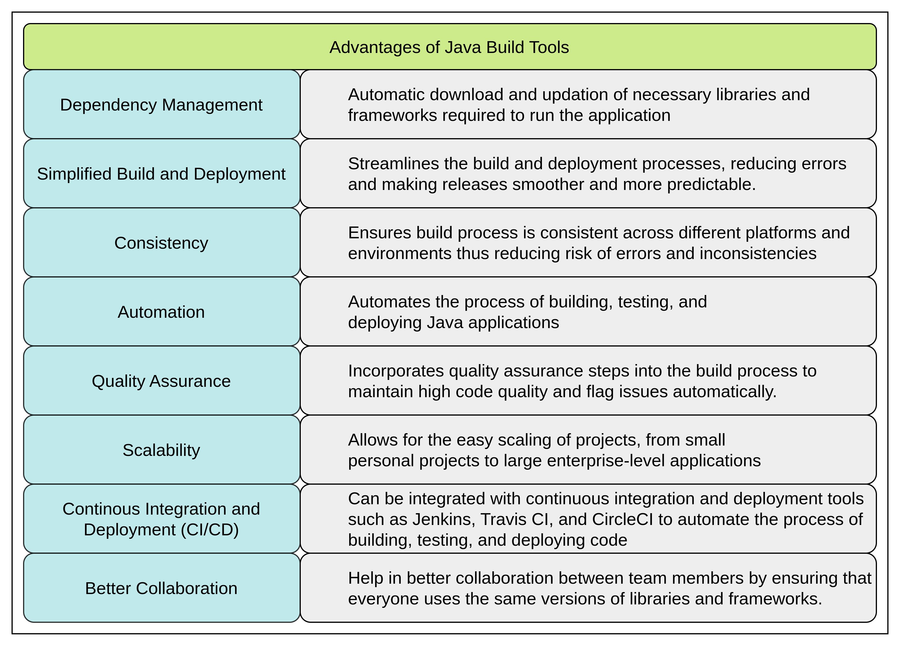

# Java Build Tools

Java build tools are utilities that automate the process of compiling, packaging, testing, and deploying Java applications. They manage dependencies, build configurations, and other tasks related to the software development lifecycle. Using build tools ensures consistency, reduces manual effort, and helps in managing complex projects efficiently.

## Features and Advantages of Build Tools

## Popular Java Build Tools

## Maven vs Gradle

## Choosing the Right Tool

**Maven**: Best for standard Java projects with extensive dependency management needs. \
**Gradle**: Ideal for large, complex projects requiring high customization and performance. \
**Ant**: Suitable for projects needing custom build processes or for legacy projects. \
**SBT**: Best for Scala and Java hybrid projects or for developers who prefer Scala. \
**Ivy**: Enhances Ant with modern dependency management. \
**Bazel**: Best for very large-scale, multi-language projects with a focus on performance. \

## References

- Java Build Tools @ [Naukri Code360 learning path](https://www.naukri.com/code360/guided-paths/advanced-java/content/498414/offering/7421430)
- https://techvify-software.com/java-build-tools/